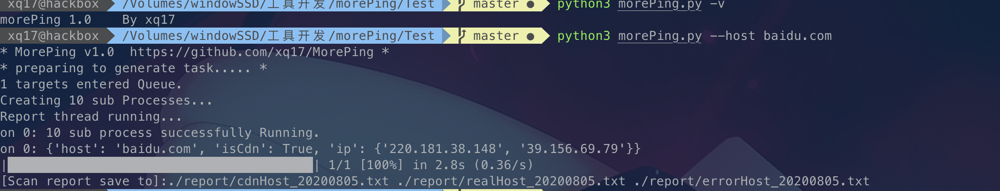
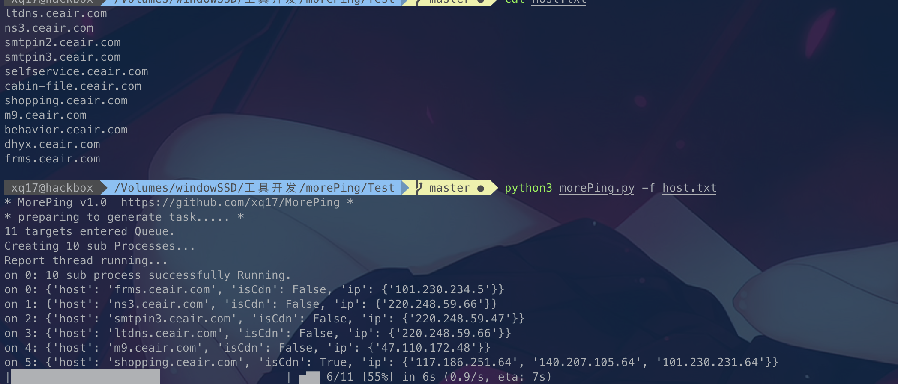
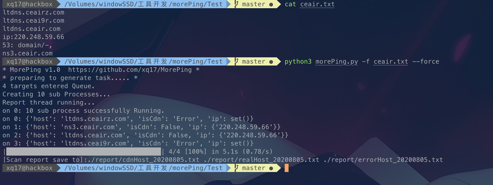

# MorePing
 A cdn detector with high speed! 基于Python 多线程+多协程通过调用API接口来高速批量多地Ping来检测资产CDN归属

#### Installation

```shell
git clone https://github.com/mstxq17/MorePing.git
cd ./MorePing
pip3 install -r requirments.txt
```

#### Usage

```shell
usage: morePing.py [options]

* A cdn detector with high speed *

optional arguments:
  -h, --help     show this help message and exit
  --host HOST    Scan host fr om command line
  -f TargetFile  Load new line delimited targets from TargetFile
  -p PROCESS     Number of processes running concurrently, 10 by default
  --force        Force to extract host from irregular Text
  -v             show program's version number and exit
```

#### Example

```shell
1.check Version
	python3 morePing.py -v
2.check single host
	python3 morePing.py --host baidu.com
3.check more host from regular file
	python3 morePing.py -f hosts.txt -p 8
4. check mote host from disorder and chaos file (Regular match host automatically)
	python3 morePing.py -f other.txt --force -p 8
```

#### Demo









#### TODOS

- [ ] 增加更多的多地Ping API的接口


#### KnowBUGS

- 当线程数过大的时候,API接口会限制频繁请求,会出现gevent请求异常


